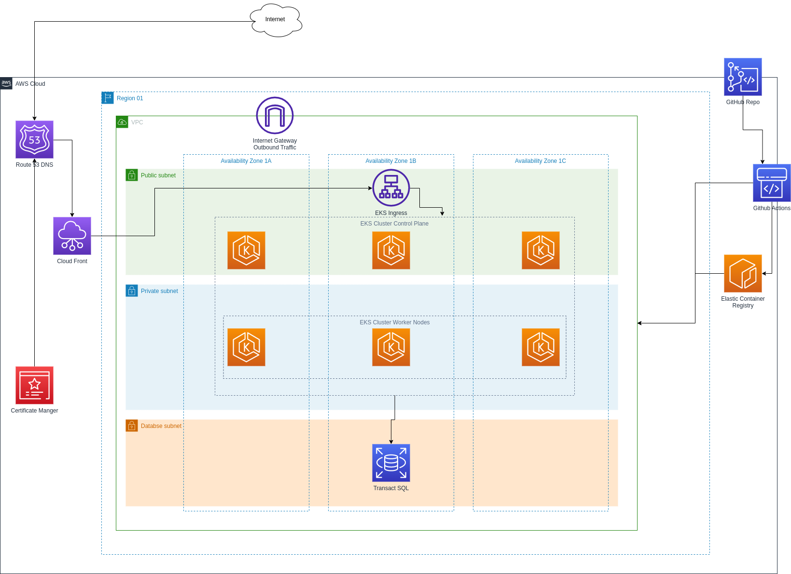
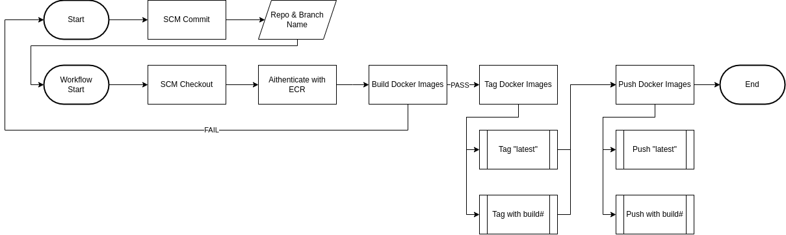
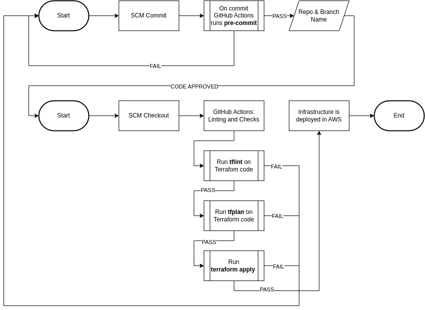
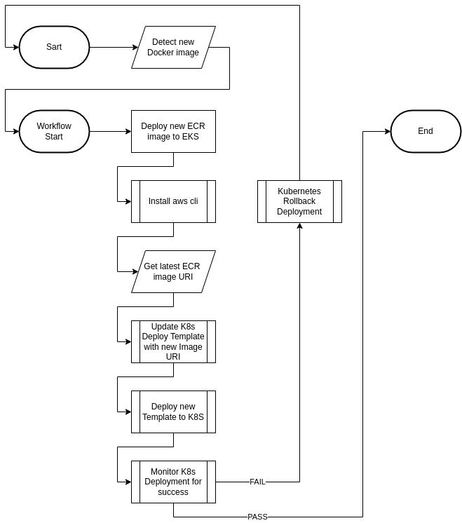

# Table of Contents
[Problem 1](#problem-1) 
[Problem 2](#problem-2) 

## Problem 1

How would you deploy this application to AWS or Azure? 
https://github.com/vercel/  

* Create an architecture diagram of your solution, e.g. using https://draw.io/
* Describe your build pipeline, including tools used.

### Solution

Since this is a static site and more than likely a low cost operation, this  project would be a perfect candidate for containerization inside AWS using Elastic Container Services. 
The Docker image can be stored inside Elastic Container Registry and updates to the container code would be pushed in there, cost of this would be much less than creating a registry anywhere else. Normally I would use Terraform for IaC deploying inside AWS, however since this is a fairly basic site with mostly static elements I would opt for using a CloudFormation stack and as many AWS services as possible.  

The stack code can be stored inside either GitHub, or CodeCommit and the pipeline can be developed using Github actions or CodePipeline. Personally I would opt for GitHub actions, as this would probably fit inside the free actions tier and developers are more familiar with using and navigating GitHub for code commits. Additionally this does not put all the eggs in one basket, so if something goes wrong with an AWS service, which I have seen in the past, the code can be deployed in another AWS region. 
The CI/CD pipeline would deploy the CloudFormation stack inside of AWS. Since this is a static site the pipeline trigger can be managed and handled manually. 
The CloudFormation stacks would be Handled inside Actions using AWS CLI to deploy the stacks into AWS. 
A separate pipeline and repo would handle the blog updates and each time a commit is pushed to the repo an automatic trigger would fire off an Actions pipeline that would also use AWS CLI to push the new MD blog files to the EFS storage. 
Upon site refresh the new blog document should be picked up and published. 

One thing to consider would be the amount of traffic the blog gets. Albeit this being a static site, if we are using a container there is a limit on how many concurrent users can browse the site before it falls over due to insufficient resources. If a high level of traffic is expected I would opt to use a scalable ECS Fargate serverless cluster with a load balancer. Fargate serverless is a low management cluster option and the details of upgrading and managing the cluster are mostly taken care of by AWS. 
Usage would have to be monitored and defined metrics would scale the application. 
Auto scaling groups would automatically add or remove instances when demand spikes or recedes. The load balancer in front of the cluster would manage the traffic bound for the application instances.  

The only elements of the site that change are the additional blog posts.  
As such one can create a container that maps the `/_posts` folder inside to AWS EFS. If the user wishes to add a post to their blog they can upload a new MD file to the EFS storage, which is mapped inside the containers. Another repository pipeline can handle the MD file uploads to the EFS storage inside of AWS.  

In the end there would be 3 repositories and 3 pipelines, one for infrastructure, the docker image, and handling of the blog posts. 
These pipelines can leverage the `install-aws-cli-action` in GitHub Actions to perform all tasks required to push the code changes from the repositories into AWS. 

#### Architecture Diagram

## Problem 2

How would you adapt this legacy application to AWS or Azure?  
https://github.com/alimon808/  

* What updates to the code would you recommend?
* Create an architecture diagram of your solution, e.g. using https://draw.io/
* Describe your build pipeline, including tools used.

### Solution

I would opt to use Elastic Kubernetes Services (EKS) which is Platform as a Service (PaaS) with Terraform for the Infrastructure as Code (IaC) component for this application. Pipelines would be designed in GitHub actions.  

I would use an EKS cluster (Kubernetes) with a Kubernetes ingress (AWS Application Load Balancer) to host this application due to the complexity of its design. The cluster would have a public and private IP range. The public range would be reserved for the control plane and the private would be reserved for the pod network only. This adds a layer of security and allows for growth. There are a lot of application components which I would opt to split into containers and run them in separate pods inside of Kubernetes (k8s). Additionally EKS can natively tie into some of the Security identity providers that are required by the application. Some of the resource requirements for this application also make k8s an application of choice. The docker images would be hosted inside of an ECR repo. 

The requirement for the InMemoryDatabase for testing, leveraging taints and tolerations the testing can be isolated to a specific EKS cluster node as to avoid eating up resources for the rest of the application. This can also be said for any other parts of the applications that may run a mock with resources, pods that run inside Kubernetes can leverage limits, ranges, and quotas on top of taints and tolerations. Separating parts of the application into smaller containers allows for the fine tuning of the app and limiting specific parts of the application for eating up too many resources that may impact the overall performance.  

For the Rest API I would transition the code into the hosted Amazon API Gateway, it is a very robust service with a free tire that offers RESTful API services that can be connected to other AWS or on-premises services. This also alleviates the EKS cluster having to do the heavy lifting of the rest api and can increase the security of the overall application. 

I would host the code inside of GitHub and leverage a custom self-hosted runner in GitHub Actions to perform the Moq and xUnit testing. 
The Infrastructure Terraform code would be deployed using GitHub Actions with the assistance of linters. 

In addition to the above I would employ the use of Route 53, certificate manager, and Cloudfront CDN. Also I am under the assumption that the application may require a Transact SQL back end, so I would plan for that as well. With GitHub actions we can perform some basic linting and checks, `pre-commit` is useful for identifying simple issues on the code before review, on the Terraform code one can use `tflint`, once these pass we can finally run `terraform plan` inside the pipeline to check that the code works and will deploy inside of the AWS environment. 
The Terraform code should be split up between Networking, EKS, ArgoCD, and other critical components, this is to minimize the blast radius when pushing updates to the infrastructure code.  

Finally one can use ArgoCD git-ops for deploying Kubernetes changes inside the cluster itself. This final piece allows total automation of deployments inside the cluster.  

#### Architecture Diagram

#### Docker Image Build Pipeline

The docker build pipeline using GitHub actions uses the AWS Cli to push the new image to AWS ECR registry.  
This pipeline is automatically fired off on code commit.  
This is only used to build and test new Docker images for the various components of the application. 
There would be several of these pipelines to accommodate the various images of the application.  

#### Infrastructure Deployment Pipeline

This pipeline deploys the AWS infrastructure using Terraform.  
In addition to this it performs checks on the code using linters and terraform plan.  
In production this pipeline should always be triggered manually.  

#### K8S Deployment Update

The Kubernetes deployment pipeline could be triggered when a new image is detected in the ECR repo, or alternatively if the [Docker Image Build Pipeline](#docker-image-build-pipeline) has passed after a new image push.  
For production purposes this pipeline should be triggered manually.  
If the new deployment fails the pipeline will trigger a deployment rollback and fail. 

